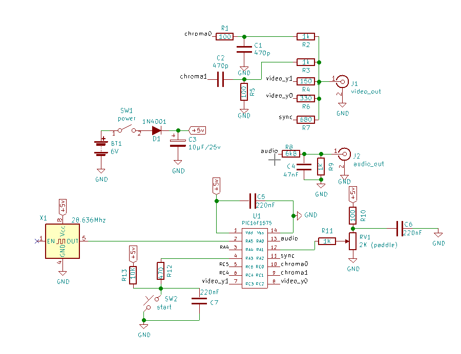
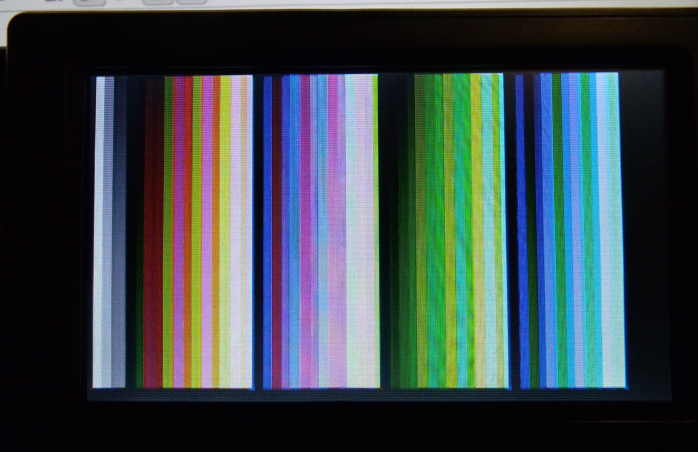

NTSC-1575
=========

 Je voulais poursuivre mes expérimentations sur ce sujet en générant plus de couleurs. Pour ce faire j'avais besoin
d'un MCU avec plus de broches et un PWM supplémentaire. Ça tombe bien puisque le PIC12F1572 a un grand frère appellé
PIC16F1575 qui répond exactement à ce besoin. En effet il est disponible en PDIP-14 et possède 4 PWM.

Référez-vous à la schématique suivante pour les explications qui suivent.

Comment ça fonctionne.
------------
 Il s'agit de produire 2 signaux chroma déphasés de 90&deg; l'un par rapport à l'autre. PWM1 et PWM2 génèrent
2 signaux identiques à la fréquence de 3.579546Mhz. Pour les déphaser l'un par rapport à l'autre j'utilise un
réseau R-C.  Le signal **chroma0** est acheminé à travers **R1-C1** qui produit un déphasage de **-45&deg;** tandis
que le signal **chroma1** est acheminé à travers **C2-R5** qui produit un déphasage de **+45&deg;**. Il en résulte
donc une différence de phase de **90&deg;** entre les deux signaux qui sont additionnés à la jonction de **R2-R3**.
Comme on le sait la couleur dans un signal NTSC est déterminée par la phase du signal chroma (modulation de phase).
L'intérêt d'additionner 2 signaux déphasés de 90&deg; est que justement on peut modifier cette phase. En effet la
phase du vecteur résultant dépend alors que de l'amplitude respective des 2 signaux. Dans ce cas ci les 2 signaux
 ont la même amplitude donc la somme donne un vecteur dont la phase est à 0&deg;.
On peut obtenir 3 phases résultantes, en coupant l'un des 2 signaux la phase est celle du vecteur unique qui demeure
actif,i.e. **-45&deg;** ou **+45&deg;** et lorsque les 2 signaux sont actifs on obtient un signal à **0&deg;**.

Maintenant puisque les périphériques PWM ont un bit **POL** qui permet d'inverser le signal de sortie (déphasé de 180&deg;)
en changeant la valeur de ce bit dans chacun des PWM on peut déplacer les vecteurs d'un quadrant à l'autre ce qui
donne donc 8 phases différentes au total. 

En plus de ces 8 phases on a 2 bits de luminance **video_y0** et **video_y1** ce qui donne 4 niveau de gris.
**NOIR**, **GRIS SOMBRE**, **GRIS CLAIR** et **BLANC**. En combinant ces 4 niveaux de gris aux 8 phases chromatiques
on obtient donc 48 couleurs différentes. A ces couleurs on ajoute les 4 tons de gris lorsqu'on coupe le signal 
chroma, ce qui nous donne bien 52 couleurs.   

52 couleurs avec un circuit aussi simple, pas mal non?
