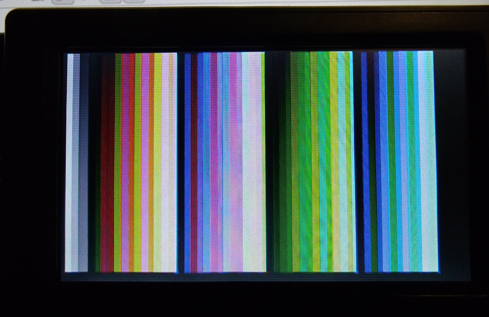

ntsc-1575
=========

Extending on this project I decited to use a PIC16F1575 in 14 pins PDIP format. This enable me to generate more
colors. This simple circuit can generate 52 colors using 4 palettes of 12 colors + 4 gray levels.

Refer to the following schematic for the explanations.

How it works
------------
 The PIC16F1575 has 4 PWM peripherals PWM1 and PMW2 are used to generate the same chroma frequency of 3.579545Mhz.
But at each output there is an RC network to dephase each signal from each other. **chroma0** is sent to **R1-C1**
 which delay it by -45&deg;. **chroma1** is sent to **C2-R5** which create a phase advance of +45&deg;. Then the phase
difference between the 2 signal is 90&deg;. Both signals are sent to a summing point through **R2** and **R3**. So
the phase is a resultant of the 2 vectors sum. Assuming both vectors have the same amplitude at summing point we get
3 possibles sum, when **chroma0** is cutoff, **chroma1** is cutoff and both signals are on. but as the PWM peripherals 
have a **POL** to invert the output (*180&deg; dephasing*) playing with output cutoff and POL bit of each PWM we 
get 8 combinations total. The using **video_y0** and **video_y1** bits to vary the luminescence level we get 4*8=
48 colors to which we add the 4 gray scale level when no chroma signal is used.

