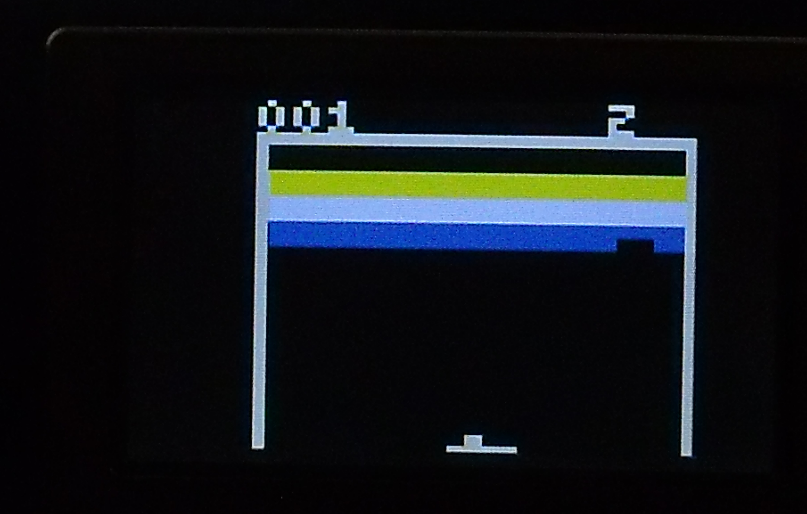

Jeu breakout
============

Introduction
------------
  Le jeu d'arcade [breakout](https://fr.wikipedia.org/wiki/Breakout_(jeu_vid%C3%A9o,_1976)) date de 1976. Il s'agit d'un dérivé du jeu pong.
  L'Objectif est de détruire un mur de briques avec une balle qui rebondie sur une raquette qui est au bas de l'écran. Dans cette version
  du jeu le mur comprend 6 rangés de 12 briques. 
  

  Le joueur dispose de 3 balles. Si une balle manque la raquette est elle perdue. Lorsque la balle frappe une brique elle rebondie mais la brique
  disparaît. 
  
  Le pointage se compte de la façon suivante, La rangée du haut est la rangée 1 et celle du bas 6.
  
  rangée | couleur | points
  -------|---------|--------
  1 | jaune | 9
  2 | jaune | 9
  3 | mauve | 7
  4 | mauve | 5
  5 | bleu | 3
  6 | bleu | 1
  
  Le pointage maximal est donc de 24*9+12*7+12*5+12*3+12=408
  
  
Objectif du projet
------------------
	Mon ojectif avec ce projet était de créer le circuit le plus simple possible pouvant générer un signal composite couleur répondant au standard NTSC.
	Le circuit que j'ai conçu ne comprend que 2 composants actifs, soit un microcontrôleur PIC12F1572 et un oscillateur a cristal de 28.636Mhz. Tous les
	autres composants sont passifs et pour l'essentiel il s'agit de condensateurs et de résistances.
	
  

	Ce circuit peut générer les 6 couleurs suivantes.
	
couleur      |  C (RA1) |  Y (RA4)
-------------|----------|-------------
noir       |    Z     |  Z
blanc      |    Z     |  1
jauce      |    R     |  1
mauve      |    I     |  1
bleu       |    I     |  Z
vert-foncé |    R     |  Z 
    

légende | description
---------|-----------
**Z** | broche en haute impédance
**R** | signal chroma en phase avec le chroma sync
**I** | signal chroma en inversion de phase avec le chroma sync
**1** | sortie Y au niveau Vdd.
**Y** | signal niveau luminance
**C** | signal chroma 3.579545Mhz
       
    Le signal vidéo n'est pas controlé avec le registre **LATA** mais avec le registre TRISA. Pour couper un signal le bit **TRISA** correspondant à la broche
    est mis à 1. Pour activé le signal il est mis à zéro.  Par exemple pour produire du blanc le bit corresponand à **RA4** dans **TRISA** est mis à **0** tandis
    que le bit correspondant à **RA1** est mis à 1.  Le bit **RA4** dans **LATA** est initialisé à **1** et demeure à ce niveau en permance.
    
	Le PIC12F1572 est disponible en format DIP 8 broches. L'utilisation des broches est la suivante.
	
broche |  signal
-------|--------
RA0  |  sortie audio et lecteur du potentiomètre
RA1  |  sortie chroma  (C)
RA2  |  sortie synchronisation
RA3  |  entrée bouton
RA4  |  sortie luminance (Y)
RA5  |  entrée de l'oscillateur externe.
      
    L'oscillateur externe a été sélectionné à la fréquence de 28.636 Mhz parce que cette fréquence correspond à 8 fois la fréquence du signal chromatique du 
    standard NTSC. Ce qui permet de générer un signal chromatique en utilisant un périphérique PWM.  Le standard NTSC utilise la modulation de phase pour
    déterminer la couleur et puisque le PWM du PIC12F1572 permette d'inverse la phase de sortie simplement en commutant un bit dans le registre PWMxCON
    on peut de ce fait produire 2 couleurs différentes simplement en commutant ce bit. Sans cette possibilitée ce circuit ne pourrait produire que 4 couleurs
    au lieu de 6.

Logiciel
---------

Pour le logiciel j'ai utilisé la même stratégie que j'avais utilisée pour le jeu [pong sur pic12f322](https://picatout.wordpress.com/2013/08/17/pong-sur-pic10f322/).
C'est à dire qu'une fois l'initialisation du MCU complétée tout se passe à l'intérieur de la routine d'interruption. Cette interruption est déclenchée à la fin de chaque période du périphérique PMW3 qui fonctionne à la fréquence 15734 Hertz qui est la fréquence horizontal pour un signal NTSC. Il y a donc une interruption à chaque ligne vidéo.  Comme toutes les lignes de la trame ne sont pas visibles à l'écran certaines sont utilisées pour accomplir d'autres tâches. Les tâches sont les suivantes.

scan lines  | slices  |   usage
-|-|-
1-3       |  6      | task 0, vertical pre-equalization
4-6       |  6      | task 1, vertical sync
7-9       |  6      | task 2, vertical post-equalization
10        |  1      | task 3, synchronization end
11        |  1      | task 4, reserved slot, do nothing    
12        |  1      | task 5, sound timer
13        |  1      | task 6, user input
14        |  1      | task 7, move ball
15        |  1      | task 8, collision control
16-29     |  14     | task 9, do nothing until first visible line    
30-49     |  20     | task 10, display score and balls count
50-57     |  8      | task 11, draw top border
58-73     |  16     | task 12, draw space over bricks rows
74-121    |  48     | task 13, draw 6 bricks rows
122-241   |  120	 | task 14, draw space below bricks rows
242-249   |  8      | task 15, draw paddle
250-262/3 |  11/12  | task 16, wait end of field    

**slice** est une variable qui détermine le nombre de lignes consacrés à chaque tâche. Les tâches **10** à **15** sont consacrées à l'affiche en tant que tel. La tâche **9** qui se déroule sur 14 lignes ne fait rien. Ces lignes ne sont pas visibles à l'écran et n'ont pas d'utilité dans ce programme.

Le **PIC12F1572** possède 3 périphériques PWM de 16 bits chacun avec son horloge indépendante ce qui permet beaucoup de flexibilité. Les seul périphérique utilisés sont les suivants:

périphérique | usage
-|-
PWM1| sortie signal chroma 3.58 Mhz sur broche RA1
PWM2| sortie son sur broche RA0, partagée avec le potentiomètre.
PMW3|génération signal vidéo à 15734 hertz
ADC| canal zéro sur broche RA0, lecture du potentiomètre
      

démo
----
[Un court vidéo de démonstration sur youtube](https://youtu.be/5JV19paUu_A)

[mon blogue sur wordpress](https://picatout.wordpress.com/)